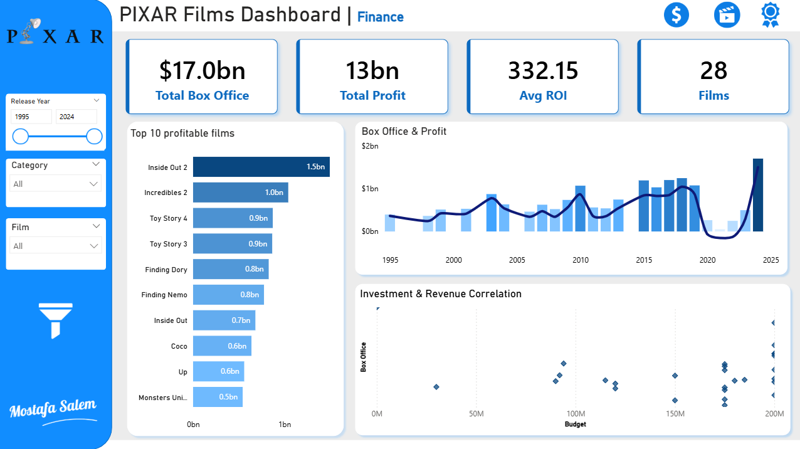
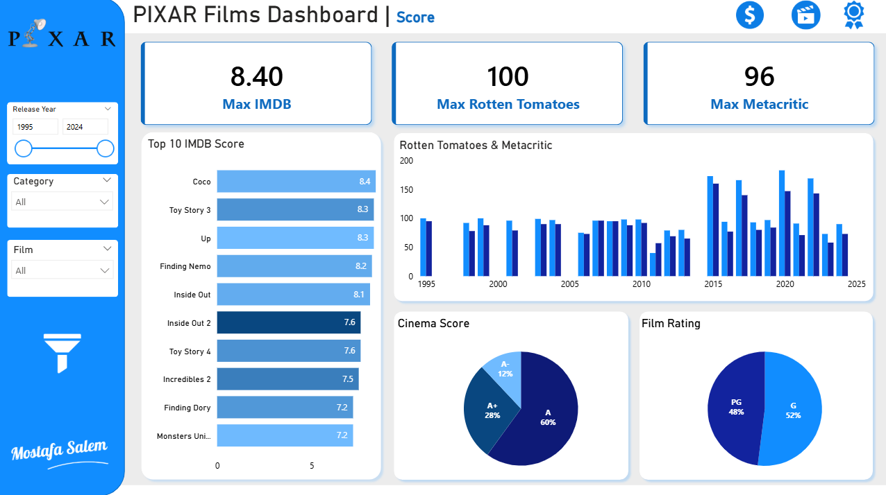
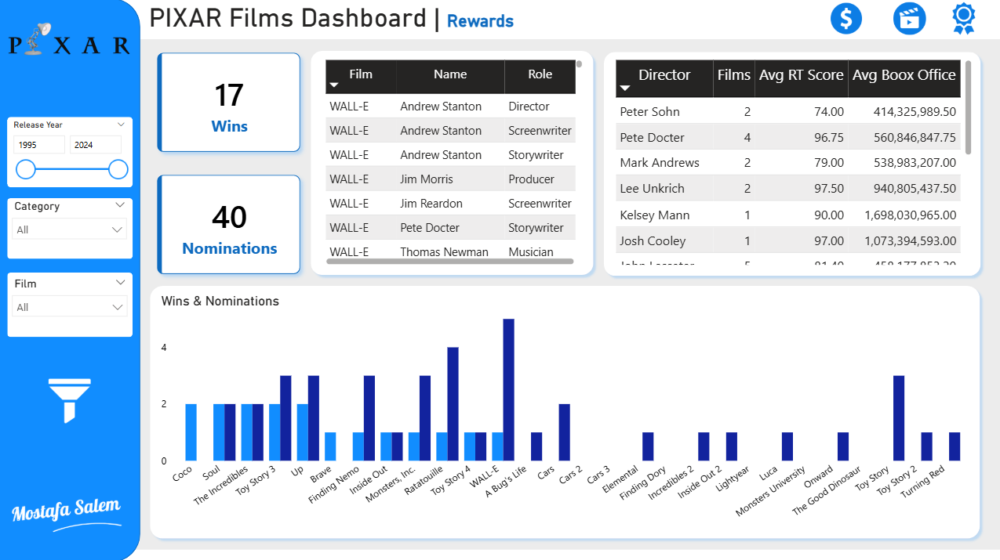

# PIXAR Films Analysis
This project analyzes data about Pixar films using MySQL for data processing and Power BI for visualization. The dataset includes information about films, their financial performance, genres, public reviews, awards, and the people involved in their production.

## Dataset Overview

The dataset consists of the following tables:

- **box_office**: Contains financial data such as budget, box office earnings in the US/Canada, other regions, and worldwide.
- **pixar_films**: Includes basic film information like release date, runtime, and rating.
- **genres**: Lists genres and subgenres for each film.
- **public_response**: Holds review scores from Rotten Tomatoes, Metacritic, CinemaScore, and IMDb.
- **academy**: Records Academy Award nominations and wins for each film.
- **pixar_people**: Details the people involved in each film and their roles (e.g., director, musician).

## SQL Scripts

The SQL code for creating the necessary views is located in the `sql` folder in the file `pixar.sql`. These views prepare the data for analysis by combining and aggregating information from the dataset tables.

### Views

#### films_overview

This view combines data from `pixar_films`, `box_office`, `public_response`, and `academy` to provide a comprehensive overview of each film. It includes:

- Film name
- Release year and date
- Runtime and rating
- Budget and box office earnings
- Calculated profit and ROI
- Review scores from various sources
- Number of Academy Award nominations and wins

#### genres_data

This view provides information about the genres and subgenres of each film.

#### people_data

This view lists the people involved in each film and their roles.

#### award_categories

This view aggregates the number of Academy Award nominations and wins by award type.

#### genre_performance

This view calculates the number of films, average box office earnings, and average Rotten Tomatoes score for each genre.

#### director_performance

This view calculates the number of films, average box office earnings, and average Rotten Tomatoes score for each director.

## Power BI Dashboard

The Power BI dashboard visualizes the data from the SQL views to provide insights into Pixar films' performance. Key visualizations include:

- **Financial Performance**: Line charts showing box office earnings and profit over time.
- **Critical Reception**: Scatter plots comparing review scores to box office earnings.
- **Genre Trends**: Bar charts displaying average box office and review scores by genre.
- **People Involved**: Charts showing the number of films and average performance metrics by director.
- **Award Success**: Stacked bar charts illustrating nominations and wins by award category.

### Dashboard Screenshots

#### PIXAR Films Dashboard | Finance

- **Layout**: A financial dashboard with a filter panel on the left for "Release Year," "Category," and "Film."
- **Key Sections**:
  - **Key Metrics**: Boxes displaying total box office ($17.0bn), total profit (13bn), average ROI (332.15%), and number of films (28).
  - **Top 10 Profitable Films**: A horizontal bar chart listing the top 10 films by box office earnings, with "Inside Out 2" at the top.
  - **Box Office & Profit Chart**: A dual-axis chart showing box office earnings (bars) and profit (line) over time.
  - **Investment & Revenue Correlation**: A scatter plot analyzing the correlation between budget and box office revenue.
- **Design Elements**: User-friendly layout with clear labels, interactive filters, and navigation icons for additional sections.

#### PIXAR Films Dashboard | Score

- **Layout**: A dashboard with a vertical panel on the left featuring the Pixar logo and interactive filters for "Release Year," "Category," and "Film."
- **Key Sections**:
  - **Maximum Scores**: Boxes displaying the maximum IMDb (8.40), Rotten Tomatoes (100), and Metacritic (96) scores.
  - **Top 10 IMDb Score Chart**: A horizontal bar chart listing the top 10 films by IMDb score, with "Coco" at the top.
  - **Rotten Tomatoes & Metacritic Chart**: A combined bar chart showing scores over time.
  - **Cinema Score Pie Chart**: A pie chart breaking down Cinema Score ratings (A: 60%, A+: 28%, A-: 12%).
  - **Film Rating Pie Chart**: A pie chart showing the distribution of film ratings (PG: 48%, G: 52%).
- **Design Elements**: Clean and user-friendly layout with blue and white colors, interactive filters, and navigation icons for additional sections.

  
#### PIXAR Films Dashboard | Rewards

- **Layout**: A detailed dashboard with a blue vertical panel on the left featuring the Pixar logo and interactive filters for "Release Year" and "Category."
- **Key Sections**:
  - **Wins & Nominations**: Displays "17 Wins" and "40 Nominations" in large cards.
  - **Roles and Contributions**: A table detailing individuals involved in "WALL-E," including directors, screenwriters, and musicians.
  - **Director Metrics**: A table listing directors with their number of films, average Rotten Tomatoes score, and average box office earnings.
  - **Awards Bar Chart**: A bar chart comparing the number of awards (wins and nominations) across various Pixar films, with "WALL-E" having the highest bar.
- **Design Elements**: Clean, professional layout with blue and white color schemes, interactive filters, and the creator's name, "Mostafa Salem."

## How to Use

1. **Set Up the Database**:
   - Create a MySQL schema named `pixar`.
   - Import the provided CSV files into the respective tables (e.g., `box_office.csv`, `pixar_films.csv`, etc.).
   - Run the SQL script  to create the views.

2. **Connect Power BI to MySQL**:
   - Open Power BI Desktop.
   - Select "Get Data" > "MySQL Database".
   - Enter your server and database details.
   - Select the views: `films_overview`, `genres_data`, `people_data`, `award_categories`, `genre_performance`, and `director_performance`.
   - Load the data.

3. **Build the Dashboard**:
   - Use the imported data to create visualizations as described.

## Conclusion

This project demonstrates how to leverage SQL for data processing and Power BI for visualization to analyze film data effectively. The insights gained can help understand trends in financial success, critical reception, and the impact of genres and directors on Pixar films.

Future enhancements could include:

- Incorporating more detailed financial data, such as marketing budgets.
- Analyzing the relationship between film runtime and success metrics.
- Exploring the impact of specific subgenres or combinations of genres.
